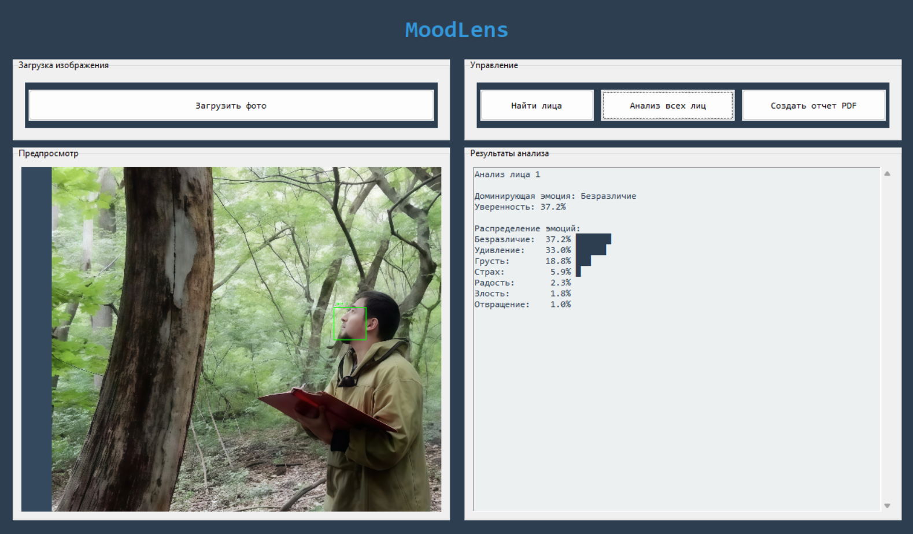
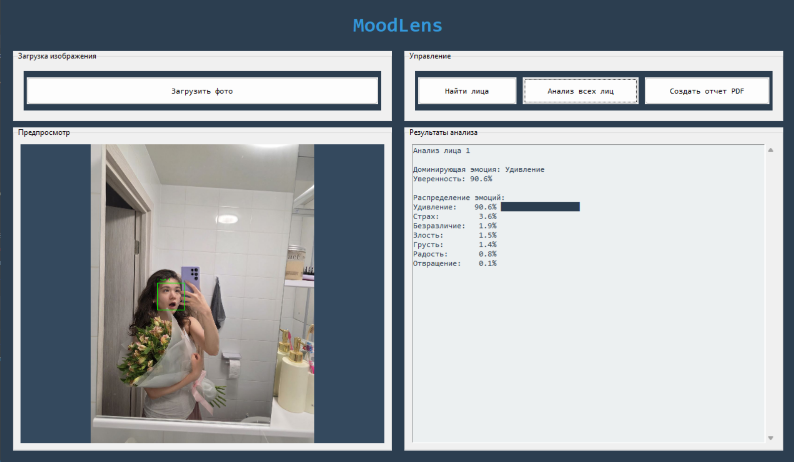
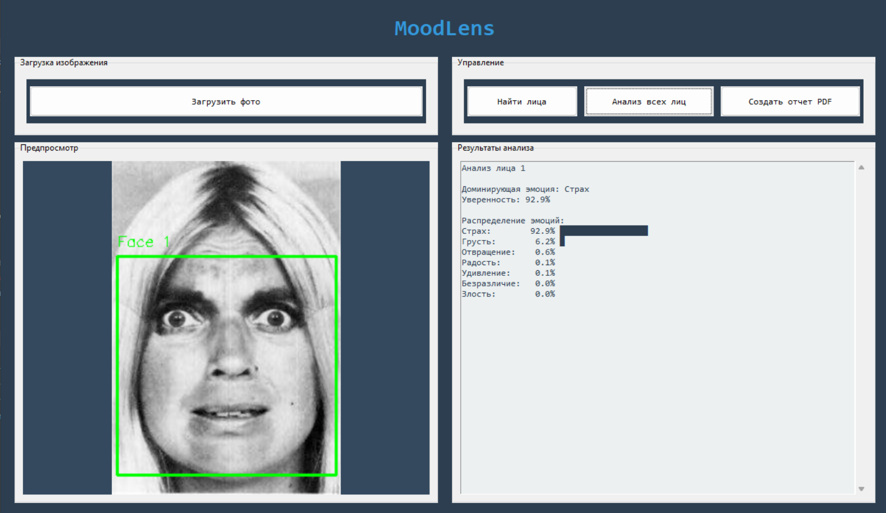

## MoodLens - система определения эмоционального состояния человека по фото
------------------
### Описание проекта
MoodLens - desktop-приложение для анализа эмоционального состояния. Система распознает и классифицирует до 7 эмоций по изображениям лиц, предоставляя анализ с вероятностностной оценкой уверенности и отчетами по результатам анализа. Поддерживаемые форматы изображений png, jpg, jpeg.
Важность распознавания эмоций проявляется в следующих областях:
- Взаимодействие человека с компьютером
FER может улучшать взаимодействие между людьми и компьютерами, позволяя создавать более проработанные интерфейсы, улучшая удовлетворенность пользователей
- Оценка психического здоровья 
FER можно использовать для мониторинга и оценки эмоционального благополучия людей. Например, она может помочь выявлять признаки депрессии, тревоги и других психических расстройств путем анализа мимики в динамике
- Системы безопасности
В сфере безопасности и наблюдения FER может применяться для выявления подозрительного поведения или индикаторов стресса, способствуя предотвращению преступной деятельности 
- Образование и обучение
В образовательной среде FER можно использовать для оценки вовлеченности и эмоционального состояния учащихся в процессе обучения, что позволяет педагогам адаптировать свои методы преподавания
- Развлечение и видеоигры
FER может улучшить игровой опыт, позволяя персонажам реагировать на эмоции игроков, создавая более захватывающую и интерактивную среду 
- Обслуживание клиентов
В сфере обслуживания клиентов FER помогает понимать эмоции клиентов и повышать качество обслуживания, предоставляя представителям службы поддержки обратную связь в реальном времени
-------------------------
### Архитектура приложения
#### Основные модули
- moodlens_interactive.py
Главный модуль графического интерфейса на базе Tkinter, обеспечивающий полный цикл взаимодействия с пользователем: от загрузки изображения и обнаружения лиц до визуализации результатов и генерации отчетов. Содержит основную логику управления рабочим процессом приложения
- config.py
Центральный модуль конфигурации, определяющий ключевые параметры системы: пути к моделям машинного обучения, поддерживаемые форматы изображений, пороги уверенности для классификации эмоций, настройки визуализации (цвета рамок, толщина линий) и параметры экспорта отчетов
- train_cnn.py
Модуль обучения сверточной нейронной сети (CNN) для классификации эмоций. Реализует полный конвейер обработки данных: аугментация изображений, построение архитектуры сети, настройка гиперпараметров, обучение с контролем переобучения и сохранение весов обученной модели
- analyze_models.py
Сравнительный аналитический модуль для оценки производительности различных архитектур моделей. Проводит тестирование по метрикам (accuracy, macro F1-score, weighted F1-score), генерирует сравнительные графики 
- evaluate_models.py
Модуль валидации и тестирования готовых моделей на независимых выборках данных
- extract_landmarks.py
Модуль детектирования и извлечения лицевых landmarks с использованием библиотеки MediaPipe. Реализует обнаружение лиц на изображениях различного качества и извлечение координат ключевых точек (68-точечная модель) для последующего анализа эмоциональных паттернов
- normalize_landmarks.py
Модуль предобработки landmarks, обеспечивающий их нормализацию и стандартизацию. Выполняет масштабирование, центрирование и ротацию координат для устранения влияния положения головы и размера лица, что повышает стабильность и точность классификации эмоций
---------------------------
### Технические особенности
#### Выбор модели
Для сравнения были выбраны SimpleCNN, FerConvNet, MLP, EfficientNet_B0, SVM, Random Forest. Сравнение по macro F1 представлено на изображении.

Матрица ошибок для SimpleCNN представлена на изображении.

В таблице приведены значения метрик каждой модели.
| Модель | Accuracy | Macro F1 | Weighted F1 |
|-------------|-------------|-------------|-------------|
| SimpleCNN     | 0.7477    | 0.6502    |   0.7484   |
|  FerConvNet    | 0.7357    | 0.6486   |  0.7402   |
|  MLP   | 0.6394   | 0.4872   | 0.6218 |
| EfficientNetB0_48   | 0.5675   | 0.4577     |  0.5719    |
|  SVM (RBF)   | 0.5487  | 0.4497   |  0.5585    |
| Random Forest    | 0.5638   | 0.3642    |  0.5122   |
---------------------------------------
#### Выбор датасета
Для использования рассматривалось несколько датасетов: RAF-DB, Fer2013Plus и CK+. У CK+ недостаточно изображений для качественного обучения, а от Fer2013Plus было решено отказаться в связи с техническими ограничениями инструментов обнаружения ключевых точек лица: библиотеки не обеспечивали корректного и стабильного выделения, что приводило к невозможности формирования признаков, необходимых для обучения классификаторов.
### Установка и запуск
Скачайте или клонируйте проект

``` text
git clone https://github.com/valerianiv/MoodLens/tree/main/MoodLens
cd MoodLens
```
Создайте виртуальное окружение
```text
# для Windows
python -m venv venv 

# для Ubuntu
python3 -m venv venv
```

Активируйте виртуальное окружение
``` text
# для Windows (CMD)
.\venv\Scripts\activate.bat
# для Windows (PowerShell)
venv\Scripts\Activate.ps1

# для Ubuntu
source venv/bin/activate
```
Установите зависимости
```text
pip install -upgrade pip
pip install -r requirements.txt
```
Убедитесь, что ваши версии совместимы. При создании программной системы использовались такие версии: mediapipe 0.10.21, keras 3.12.0, protobuf 6.33.1, tensorflow 2.20.0, opencv-python 4.8.1.78.

### Примеры работы приложения
На следующем примере представлена работа на изображении с повернутым в сторону лицом, что говорит о том, что программа может справляться с ситуациями, когда лицо расположено не в анфас

На этом примере представлена работа с несколькими детскими лицами на одном изображениями, что показывает, что система может обрабатывать не только взрослые черты и успешно справляется с обработкой многих лиц одновременно

На данном примере можно заметить успешную работы системы с живыми эмоциями на фотографии из галереи

На приведенном изображении видно, что программа успешно работает и на черно-белых изображениях
